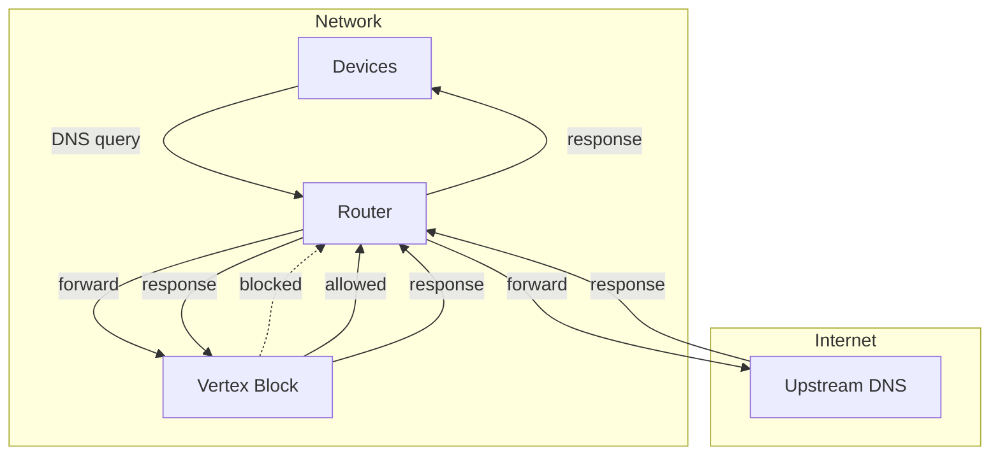
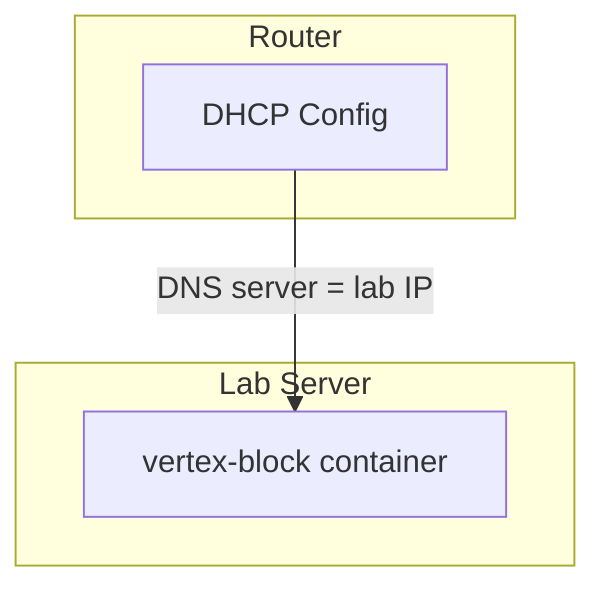

# Architecture Overview

Vertex Block is a DNS sinkhole that blocks ads and trackers at the network level.

## System Context

## Components

### DNS Server

The core component. Listens on port 53 (UDP/TCP), intercepts DNS queries, and either:

- **Blocks**: Returns empty/NXDOMAIN for domains in the blocklist
- **Forwards**: Passes allowed queries to upstream DNS servers

### Blocklist Store

In-memory set of blocked domains for O(1) lookup performance.

- Loaded from aggregated blocklist files on startup
- Supports wildcard/subdomain matching
- Refreshed periodically from sources

### REST API

HTTP API for management and monitoring.

- Query stats (blocked vs allowed)
- Blocklist management (add/remove custom entries)
- Health checks

## Data Stores

| Store | Type | Purpose |
|-------|------|---------|
| Blocklist | In-memory set | Fast domain lookup |
| Stats | In-memory counters | Query metrics |
| Custom rules | File/SQLite | User overrides |

## Port Mappings

| Port | Protocol | Purpose |
|------|----------|---------|
| 53 | UDP/TCP | DNS server |
| 8080 | TCP | REST API |

## Deployment

Runs as a Docker container on the lab server. Router configured to use it as primary DNS.

