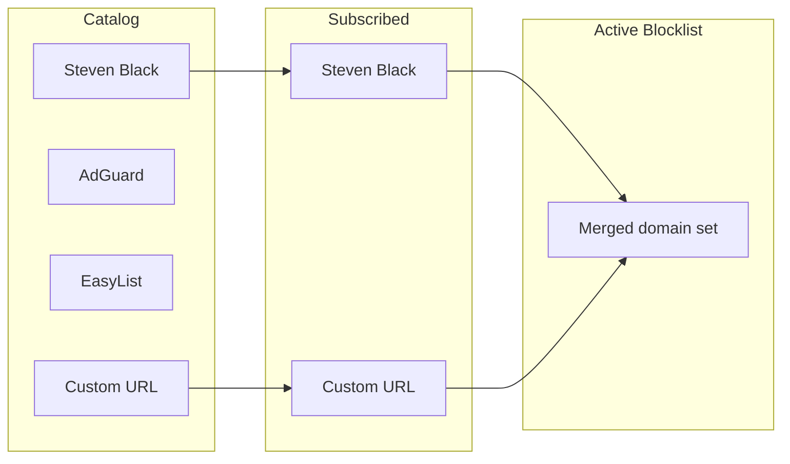
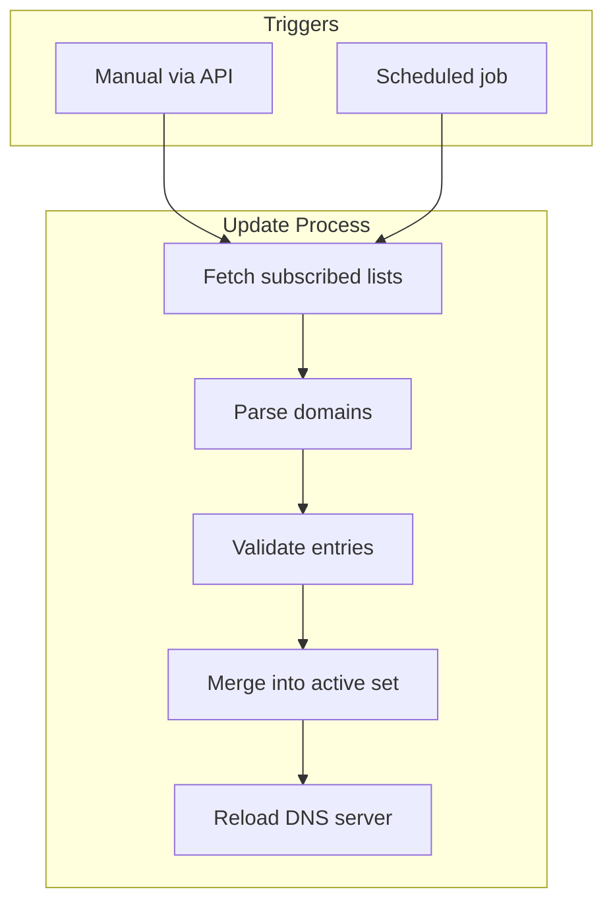

# Blocklist Management

This document details how Vertex Block handles blocklist sources, updates, and storage.

## Overview

Blocklists are user-controlled. Users subscribe to lists from a curated catalog or add custom sources. No lists are automatically enabled.

## Catalog

A built-in catalog of known blocklist sources with metadata:

| Field | Description |
|-------|-------------|
| id | Unique identifier |
| name | Display name |
| url | Source URL |
| category | ads, trackers, malware, social, etc. |
| description | What this list blocks |
| format | hosts, domains, adblock |
| update_frequency | How often the source updates (hint for scheduling) |

### Example Catalog Entry

```json
{
  "id": "stevenblack-unified",
  "name": "Steven Black Unified",
  "url": "https://raw.githubusercontent.com/StevenBlack/hosts/master/hosts",
  "category": "ads",
  "description": "Unified hosts file with base extensions",
  "format": "hosts",
  "update_frequency": "daily"
}
```

### Initial Catalog Sources

| Source | Category | Format |
|--------|----------|--------|
| Steven Black Unified | ads | hosts |
| AdGuard DNS Filter | ads, trackers | adblock |
| EasyList | ads | adblock |
| EasyPrivacy | trackers | adblock |
| OISD | ads, trackers | domains |

Catalog is stored as a JSON file, updatable separately from subscriptions.

## Subscriptions

Users subscribe to lists they want active. Subscription state is stored in config/database.



### Subscription Operations

| Operation | Description |
|-----------|-------------|
| List catalog | View all available blocklists |
| Subscribe | Add a list to active subscriptions |
| Unsubscribe | Remove a list from subscriptions |
| Add custom | Subscribe to a URL not in catalog |
| List subscriptions | View currently subscribed lists |

## File Formats

The system supports multiple blocklist formats:

### Hosts Format

```
0.0.0.0 ads.example.com
127.0.0.1 tracker.example.com
```

Parser extracts the domain, ignores the IP.

### Domain List Format

```
ads.example.com
tracker.example.com
# comment
```

One domain per line, comments with `#`.

### AdBlock Format (subset)

```
||ads.example.com^
||tracker.example.com^
@@||allowed.example.com^
```

Supports basic domain rules. Complex rules (CSS, regex) are ignored.

## Update Strategy

Updates are user-controlled:



### Manual Updates

User triggers update via API call. Fetches latest versions of all subscribed lists.

### Scheduled Updates

Optional background job runs on configurable interval (default: daily). User enables/disables scheduling.

### Update Response

```json
{
  "updated": ["stevenblack-unified", "custom-1"],
  "failed": [],
  "total_domains": 125000,
  "duration_ms": 3400
}
```

## Storage

### Raw Lists

Downloaded blocklist files stored in `blocklists/` directory:

```
blocklists/
  stevenblack-unified.txt
  adguard-dns.txt
  custom-abc123.txt
```

### Active Blocklist

Merged set of all domains from subscribed lists. Stored in memory as a Python `set` for O(1) lookup.

On startup:
1. Load raw list files
2. Parse each file according to format
3. Merge all domains into single set
4. DNS server references this set

### Metadata

Per-list metadata stored (file or SQLite):

| Field | Description |
|-------|-------------|
| list_id | Reference to catalog/custom entry |
| last_updated | When list was last fetched |
| domain_count | Number of domains in list |
| etag | For conditional HTTP requests |

## Domain Matching

When checking if a domain is blocked:

1. Exact match: `ads.example.com` in blocklist
2. Parent match: Query for `sub.ads.example.com` checks `ads.example.com`, then `example.com`

```python
def is_blocked(domain: str, blocklist: set[str]) -> bool:
    parts = domain.split('.')
    for i in range(len(parts)):
        check = '.'.join(parts[i:])
        if check in blocklist:
            return True
    return False
```

## Custom Lists

Users can add lists not in the catalog:

| Field | Required |
|-------|----------|
| url | Yes |
| name | Optional (defaults to URL) |
| format | Optional (auto-detect) |

Custom lists behave identically to catalog lists once subscribed.

## Statistics

Per-list stats available via API:

| Stat | Description |
|------|-------------|
| domain_count | Domains in this list |
| last_updated | Last successful fetch |
| hits | Queries blocked by this list (if tracking enabled) |
