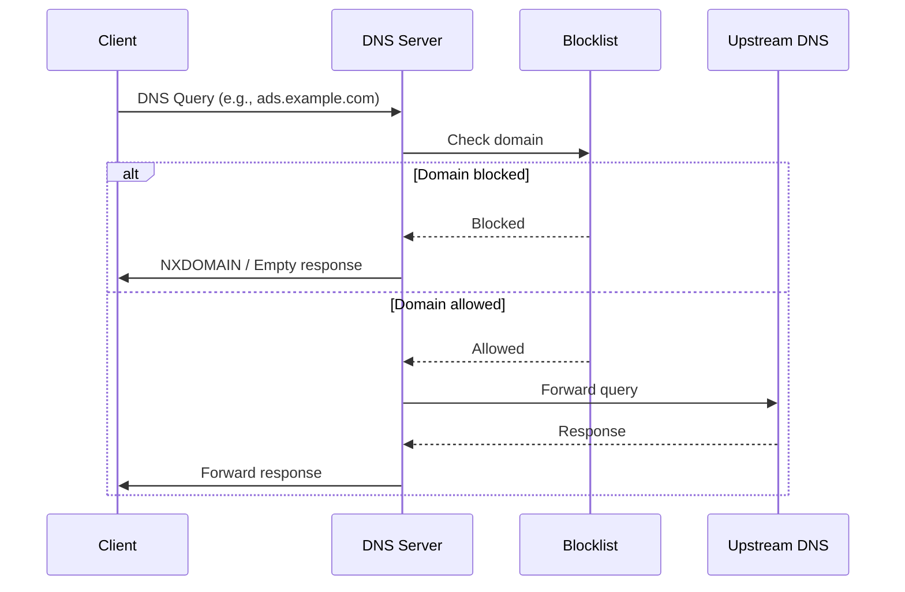
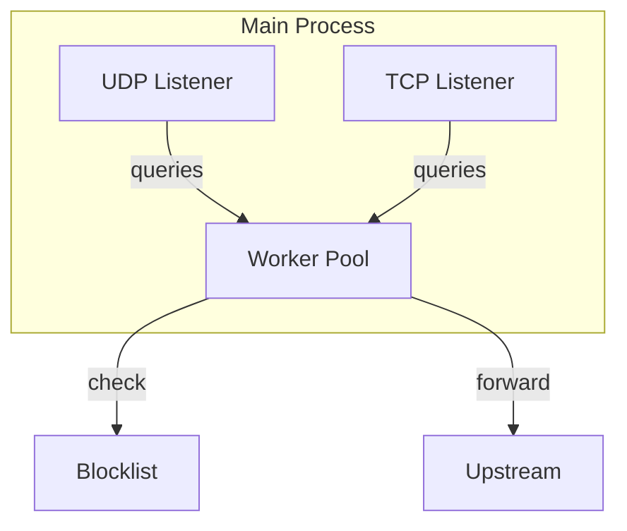

# DNS Server Design

The DNS server is the core component - it intercepts queries and decides whether to block or forward them.

## Technology

**dnspython** - Pure Python DNS library. Handles parsing, building, and sending DNS messages.

Why dnspython:
- Well-maintained, widely used
- Supports both UDP and TCP
- Handles all DNS record types
- No C dependencies (simpler Docker builds)

## Query Flow



## Server Architecture

```python
class DNSServer:
    def __init__(self, blocklist, upstream_servers, listen_port=53):
        self.blocklist = blocklist
        self.upstream = upstream_servers
        self.port = listen_port
    
    def handle_query(self, query: dns.message.Message) -> dns.message.Message:
        domain = query.question[0].name.to_text()
        
        if self.blocklist.is_blocked(domain):
            return self.build_blocked_response(query)
        
        return self.forward_to_upstream(query)
```

## Blocking Behavior

When a domain is blocked, return **NXDOMAIN** (domain does not exist):

- Clean response - clients handle it gracefully
- No connection attempts to blocked domains
- Faster than returning 0.0.0.0 (which still triggers connection attempts)

Alternative: Return `0.0.0.0` for A records, `::` for AAAA records. Some prefer this for debugging visibility.

**Decision:** Use NXDOMAIN as default, configurable to return null IPs if preferred.

## Protocol Support

### UDP (Primary)

- Default DNS transport
- Connectionless, fast
- Limited to 512 bytes (or 4096 with EDNS)
- Handle truncation flag for large responses

### TCP (Fallback)

- Used when response exceeds UDP size
- Zone transfers (not relevant here)
- More overhead but reliable

Both listeners run concurrently on port 53.

## Upstream Forwarding

For allowed queries, forward to configured upstream DNS servers.

```python
UPSTREAM_SERVERS = [
    "8.8.8.8",      # Google
    "1.1.1.1",      # Cloudflare
]
```

**Forwarding strategy:**
- Try primary upstream first
- Fall back to secondary on timeout (2 seconds)
- Preserve original query ID for response matching

## Domain Matching

Query domains are checked against the blocklist:

```
Query: ads.tracking.example.com

Check order:
1. ads.tracking.example.com  (exact match)
2. tracking.example.com      (parent domain)
3. example.com               (parent domain)
4. com                       (stop - TLD)
```

If any level matches the blocklist, block the query.

## Performance Considerations

- **Blocklist in memory**: O(1) set lookups
- **Async I/O**: Handle many concurrent queries
- **Connection pooling**: Reuse upstream connections where possible
- **No caching**: Let upstream DNS handle caching (simpler, less stale data)

## Error Handling

| Scenario | Response |
|----------|----------|
| Upstream timeout | Try next upstream, then SERVFAIL |
| Upstream unreachable | SERVFAIL |
| Malformed query | FORMERR |
| Blocklist lookup error | Allow query (fail open) |

**Fail open policy**: If blocklist check fails, allow the query rather than blocking everything.

## Threading Model



- Single process, async event loop
- UDP and TCP listeners share worker pool
- Blocklist is thread-safe read-only after load
